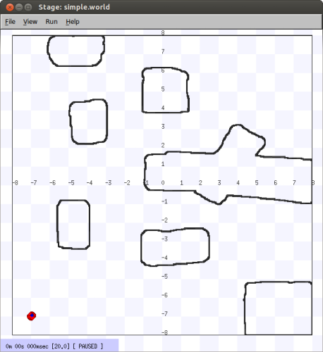

<!---
# Chapter 1 -  Introduction
--->

Player/Stage is a robot simulation tool, it comprises of one program,
Player, which is a *Hardware Abstraction Layer*. That means that it
talks to the bits of hardware on the robot (like a claw or a camera) and
lets you control them with your code, meaning you don't need to worry about
how the various parts of the robot work. Stage is a plugin to Player which
listens to what Player is telling it to do and turns these instructions
into a simulation of your robot. It also simulates sensor data and sends
this to Player which in turn makes the sensor data available to your code.

A simulation then, is composed of three parts:

* Your code. This talks to Player.
* Player. This takes your code and sends instructions to a robot. From the robot it gets sensor data and sends it to your code.
* Stage. Stage interfaces with Player in the same way as a robot's hardware would. It receives instructions from Player and moves a simulated robot in a simulated world, it gets sensor data from the robot in the simulation and sends this to Player.

Together Player and Stage are called Player/Stage, and they make a simulation of your robots.

These instructions will be focussing on how to use Player/Stage to make a
simulation, but hopefully this will still be a useful resource for anyone
just using Player (which is the same thing but on a real robot, without any simulation software).

## 1.1 - A Note on Installing Player/Stage

The install script described below has been tested with Ubuntu 12.04, 14.04, and 16.04. Each new version might introduce slightly different package names.
So its up to you to keep updating this script in the future.

```tiobox
OS=$(lsb_release -si)
VER=$(lsb_release -sr)
OSNAME=$(lsb_release -sc)
NUM_CORES=`cat /proc/cpuinfo | grep processor | wc -l`

echo -e "${GREEN}NOTE:${NC} ${OS} - ${VER} (${OSNAME}.\n"
echo -e "${GREEN}NOTE:${NC} This computer has ${NUM_CORES} cores ...\n"

##################################################
# install commom packages
##################################################
sudo apt-get install -y build-essential
sudo apt-get install -y autoconf
sudo apt-get install -y cmake
sudo apt-get install -y cmake-curses-gui
sudo apt-get install -y git
sudo apt-get install -y pkg-config

##################################################
# install Player/Stage depedencies
##################################################
sudo apt-get install -y libfltk1.1-dev 
sudo apt-get install -y freeglut3-dev 
sudo apt-get install -y libpng12-dev 
sudo apt-get install -y libltdl-dev 
#libltdl7 
case "${VER}" in 
	14.04)
		sudo apt-get install -y libdb5.1-stl
		;;
	16.04)
		sudo apt-get install -y libdb5.3-stl
		;;
esac
sudo apt-get install -y libgnomecanvasmm-2.6-dev
sudo apt-get install -y python-gnome2
#sudo apt-get install -y libboost-all-dev  # overkill, the actually required libraries are boostthread, boostsignal, boostsystem
sudo apt-get install -y libboost-signals-dev libboost-system-dev libboost-thread-dev
# old OpenCV for older Player drivers
sudo apt-get install -y libopencv-dev libopencv-core-dev libcv-dev libcvaux-dev libhighgui-dev
# alsa - sound player
sudo apt-get install -y libasound2-dev
# alsa alsa-tools  alsa-utils
# for pmap
sudo apt-get install -y libgsl0-dev libxmu-dev
# for python bindings for Player clients - 
# It is not recommended to use python due to limitations in the bindings. 
# Things that work on a C/C++ client might not work on a Python client.
sudo apt-get install -y python-dev swig
# PostGIS for a Player driver
sudo apt-get install -y libpq-dev libpqxx-dev
# if you want to compile the html document, enable this line
#sudo apt-get install -y doxygen

##################################################
# Downloading source code 
##################################################
echo -e "${GREEN}Downloading Player source code from GitHub... ${NC}\n"
git clone https://github.com/playerproject/player.git

echo -e "${GREEN}Downloading Stage source code from GitHub... ${NC}\n"
git clone https://github.com/lsa-pucrs/Stage.git

##################################################
# set environment variables
##################################################
# these are the required environment variables for Ubuntu. Other distributions might have slightly different path names
export LD_LIBRARY_PATH=/usr/lib:/usr/local/lib/:${LD_LIBRARY_PATH}
# Opencv lib path
export LD_LIBRARY_PATH=/usr/lib/x86_64-linux-gnu/:${LD_LIBRARY_PATH}
# Player lib path
export LD_LIBRARY_PATH=/usr/local/lib64/:${LD_LIBRARY_PATH}
# setup pkgconfig and cmake. Try the following commands to find where these files are located and add all of them 
# run 'sudo find / -name "*.pc" -type f' to find all the pc files for pkg-config
# run 'sudo find / -name "*.cmake" -type f' to find all the cmake files for cmake
case "${VER}" in 
	14.04)
		export CMAKE_MODULE_PATH=${CMAKE_MODULE_PATH}:/usr/share/cmake-2.8/Modules/:/usr/share/cmake-2.8/Modules/Platform/:/usr/share/cmake-2.8/Modules/Compiler/:/usr/local/share/cmake/Modules:/usr/local/lib64/cmake/Stage/:/usr/lib/fltk/
		;;
	16.04)
		export CMAKE_MODULE_PATH=${CMAKE_MODULE_PATH}:/usr/share/cmake-3.5/Modules/:/usr/share/cmake-3.5/Modules/Platform/:/usr/share/cmake-3.5/Modules/Compiler/:/usr/local/share/cmake/Modules:/usr/local/lib/cmake/Stage/:/usr/lib/fltk/
		;;
esac
export PKG_CONFIG_PATH=/usr/local/lib64/pkgconfig/:/usr/lib/pkgconfig:/usr/lib/x86_64-linux-gnu/pkgconfig/:/usr/share/pkgconfig/:${PKG_CONFIG_PATH}

##################################################
# Compile and install Player/Stage 
##################################################
cd player
mkdir -p build
cd build
echo -e "${GREEN}Configuring Player ... ${NC}\n"
# Player has tones of parameters that can be setup individually. try 'ccmake ..' in the build dir to select them individually
# Fow now, we are using the default intallation, disabling Python bidings
cmake -DCMAKE_BUILD_TYPE=Release -DDEBUG_LEVEL=NONE -BUILD_PYTHONC_BINDINGS:BOOL=OFF ..
echo -e "${GREEN}Compiling Player ... ${NC}\n"
make -j ${NUM_CORES} 
sudo make install
echo -e "${GREEN}Player installed !!!! ${NC}\n"

cd ../../Stage
mkdir -p build
cd build
echo -e "${GREEN}Configuring Stage  ... ${NC}\n"
# Stage also have some parameters that can be selected individually. Fow now, we are using the default intallation
cmake -DCMAKE_BUILD_TYPE=Release ..
echo -e "${GREEN}Compiling Stage ... ${NC}\n"
make -j ${NUM_CORES}
sudo make install
echo -e "${GREEN}Stage installed !!!! ${NC}\n"
```

For OSX users you might find the following install instructions useful:
[http://alanwinfield.blogspot.com/2009/07/installing-playerstage-on-os-x-with.html](http://alanwinfield.blogspot.com/2009/07/installing-playerstage-on-os-x-with.html)

Even after it's installed, you may need to do some per-user setup on your
system.  For example, on our system, the following two lines (adapted as needed to your particular system) need to be
added to each user's `$HOME/.bashrc` file (or to the system-wide one): 
```
export LD_LIBRARY_PATH=/usr/local/lib64:$LD_LIBRARY_PATH}
export PKG_CONFIG_PATH=/usr/local/lib64/pkgconfig:$PKG_CONFIG_PATH}
```

Does any thing went wrong during the installation ? It is usually very simple to solve these problems. Typically, the error message says the library or piece of code 
with error. Google this library name and your linus ditribution version to find how to install the library. Install it and try it again. If the error is after installation, 
during the execution of Player, then probably you forgot to add the environment variables into your `$HOME/.bashrc` file or your system has different path names. 
Adjust it and try it again. You might also run `ldd /usr/local/bin/player` to find out which dynamic library was not found. Once you got the missing library name, 
find this library inthe system. If it was found, then add its path to the `LD_LIBRARY_PATH` enviroment variable in the `$HOME/.bashrc` file. If it was not found, 
Google it and install the library into your system. Then, try to execute Player again. 

## 1.2 - A Note about TRY IT OUT sections
There will be sections scattered throughout this tutorial labeled **TRY IT OUT**
that explain how to run examples. You'll need to download [the example
code](http://github.com/NickelsLab/Player-Stage-Manual/archive/master.zip) 
which will contain the files. In these sections, you'll be given commands to
type in a terminal
window (or bash shell). They'll be shown prefixed with a carrot `>` and
typeset in monospace font. For example, 

```
> ls
```

means to go to a terminal window and type the command given (`ls`), without
the `>` character, then hit return.

In many cases, you'll need to run the first command (`player configfile.cfg`) in the background, since it doesn't quit till player is
done.  To do this, you add an ampersand (`&`) after the command.  So if you
type `player configfile.cfg` in a terminal, it will appear to freeze.  If
you however type `player configfile.cfg &` into the terminal, it will start
up player and return.  Player will however print information and debugging
messages to your terminal, which can be a bit confusing at times.

When you use files, you should examine the files to see how they are
working, just running the examples will not teach you (as) much!

## 1.3 - TRY IT OUT (Preparation)

* If you haven't already, download the sample code from 
 [http://github.com/NickelsLab/Player-Stage-Manual/archive/v4.1.0.zip](http://github.com/NickelsLab/Player-Stage-Manual/archive/v4.1.0.zip) 
* Next, you'll need to extract the sample code.  To do this, open a
 terminal and cd to the directory where you put the file
 `master.zip`, then extract using zip.  Yes, there are
 GUI-based ways to do this too.  I won't cover them here.
* I'll assume that you want to put this directory in your home directory.
  If not, just replace the commands given with the appropriate directory. 
* I'll likewise assume that you downloaded the code into $HOME/Downloads.
  (Again, your specific path may differ.)
* (From here on out, I'll just say that your extracted source code is in
  `<source_code>` for brevity and generality.)

```tiobox
> cd $HOME
> unzip $HOME/Downloads/Player-Stage-Manual-master.zip
> cd $HOME/Player-Stage-Manual-master/code
> ls
```

At this point, you should see one directory for each setion of this manual,
which contain the code examples for the respective chapters, and one,
`bitmaps`, that has pictures used in several different examples.

## 1.4 - TRY IT OUT
First we will run a world and configuration file that comes bundled with
  Stage. In a terminal window, you will navigate to the Stage/worlds folder, by
  default (in Linux at least) this is `/usr/local/share/stage/worlds`. Type
  the following commands to run the ``simple world'' that comes with
  Player/Stage: 
```tiobox
> cd /usr/local/share/stage/worlds
> player simple.cfg 
```

Assuming Player/Stage is installed properly you should now have a window open which looks like the figure below.  Congratulations,you can now build Player/Stage simulations!




